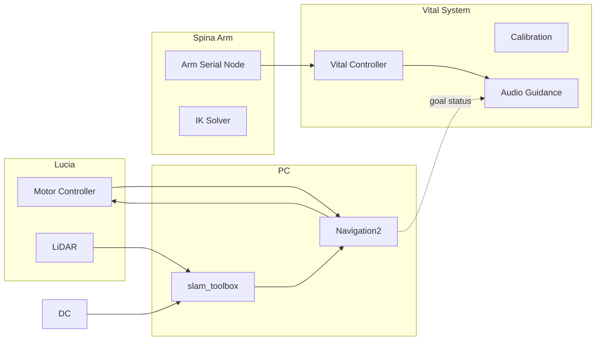

<div align="center">

# 🤖 Lucia & Spina System  
*A Modular Mobile Base + Arm + Vital Sensing Integration*  

[](https://docs.ros.org/)
</div>

## 🧩 Component Overview

| Device | Description |
|----------|----------------|
| Lucia (Base) | motors, LiDAR, Depth-Camera, SLAM, Navigation |
| Spina (Arm) | serial control & inverse kinematics |
| Vital | Vital measurement |

### System Flow Diagram



---

## 📦 Package Matrix

| Domain | Function | Repository |
|--------|---------------|------------|
| Base | Motor & Encoder Controller | [lucia_controller](https://github.com/iHaruruki/lucia_controller) |
| Base | Joystick to cmd_vel | [joy_to_cmdvel](https://github.com/iHaruruki/joy_to_cmdvel) |
| Base | URDF / Description | [lucia_description](https://github.com/iHaruruki/lucia_description) |
| Sensing | LiDAR Driver | [urg_node2_setup](https://github.com/iHaruruki/urg_node2_setup.git) |
| Sensing | Dual LiDAR Merger | [dual_laser_merger](https://github.com/iHaruruki/dual_laser_merger) |
| Sensing | Depth Camera | [ros2_astra_camera](https://github.com/iHaruruki/ros2_astra_camera) |
| Sensing | Depth Camera | [OrbbecSDK_ROS2](https://github.com/iHaruruki/OrbbecSDK_ROS2) |
| Mapping | slam_toolbox | [lucia_slam_toolbox](https://github.com/iHaruruki/lucia_slam_toolbox) |
| Mapping | Cartographer | [lucia_cartographer](https://github.com/iHaruruki/lucia_cartographer) |
| Navigation | Navigation2 | [lucia_navigation2](https://github.com/iHaruruki/lucia_navigation2) |
| Maps | Map Storage | [maps](https://github.com/iHaruruki/maps) |
| Arm | Arm Serial Control | [spina_arm_controll](https://github.com/iHaruruki/spina_arm_controll) |
| Arm | Inverse Kinematics | [spina_inverse_kinematics](https://github.com/iHaruruki/spina_inverse_kinematics) |
| Vital | Vital Measurement | [lucia_vital](https://github.com/iHaruruki/lucia_vital) |
| Vital | Calibration | [lucia_vital_calibration](https://github.com/iHaruruki/lucia_vital_calibration) |
| Vital | Vital Measurement Feedback | [lucia_vital_signs_display](https://github.com/iHaruruki/lucia_vital_signs_display) |
| Audio(JP) | Audio Generator | [audio_generator](https://github.com/iHaruruki/audio_generator.git) |
| Audio(EN) | Audio Generator | [audio_generator_edge_tts](https://github.com/iHaruruki/audio_generator_edge_tts.git) |
---

# Lucia have 4 mode
## :video_game: A. Manual Control mode

Bring up base
```bash
ros2 launch lucia_controller bringup.launch.py
```
Control via keyboard
```bash
ros2 run teleop_twist_keyboard teleop_twist_keyboard
```
Joystick
```bash
ros2 run joy joy_node
```
```bash
ros2 run joy_to_cmdvel joy_to_cmdvel_node
```
---

## 🗺️ B. SLAM (Map Building)
  
Bring up base
```bash
ros2 launch lucia_controller bringup.launch.py
```
Run slam_toolbox
```bash
ros2 launch lucia_slam_toolbox online_async_launch.py
```
Control via keyboard
```bash
ros2 run teleop_twist_keyboard teleop_twist_keyboard
```
*Start exploring and drawing the map.*
```bash
ros2 run nav2_map_server map_saver_cli -f ~/map
```
The -f option specifies a folder location and a file name where files to be saved.
With the above command, map.pgm and map.yaml will be saved in the home folder ~/(/home/${username}).

---

## 🧭 C. Navigation (Using Saved Map)

1. Bring up base
  ```bash
  ros2 launch lucia_controller bringup.launch.py
  ```
  Run navigation2
  ```bash
  ros2 launch lucia_navigation2 navigation2.launch.py \
    map:=$HOME/ros2_ws/src/lucia_navigation2/map/map.yaml \
    use_sim_time:=false
  ```
2. Initial Pose
    1. Click the 2D Pose Estimate button in the RViz2 menu.
    2. Click on the map where the actual robot is located and drag the large green arrow toward the direction where the robot is facing.
    3. Repeat step 1 and 2 until the LDS sensor data is overlayed on the saved map.
3. Send Navigation Goal
    1. Click the Navigation2 Goal button in the RViz2 menu.
    2. Click on the map to set the destination of the robot and drag the green arrow toward the direction where the robot will be facing.
---

## 🦾 D. Spina Arm Control

```bash
sudo chmod 777 /dev/ttyUSB0  # or add to dialout group
```
```bash
ros2 run spina_arm_controll serial_controller_node
```
```bash
# 例: 全体角度 +90° / Example command
ros2 topic pub /angle_cmd std_msgs/msg/String "{ data: 'A0p-090' }" --once
```
---

## 💓🔊 E. Vital Signs Display System

Run vital sensing and audio feedback pipeline.
```bash
yarpmanager --application /home/robot/repos/robot/script/ymanager/xml/applications/tutorial/tutorial_audio_3.xml
```
```bash
ros2 run spina_arm_controll serial_controller_node
```
```bash
ros2 run lucia_vital vital_controller_node
```
```bash
ros2 run lucia_vital_signs_display vital_audio_guidance_node
```
---

## 🧪 Debug
Navigation / Simulate Nav Success
```bash
ros2 topic pub \
  /navigate_to_pose/_action/status \
  action_msgs/msg/GoalStatusArray \
  "{status_list:
    [
      {
        goal_info:
          { stamp: {sec: 0, nanosec: 0},
            goal_id: {uuid: [0,0,0,0,0,0,0,0,0,0,0,0,0,0,0,1]} },
        status: 4
      }
    ]
  }" --once
```
`status: 4` = SUCCEEDED

---

## 🛠 Troubleshooting
:watch: Coming soon