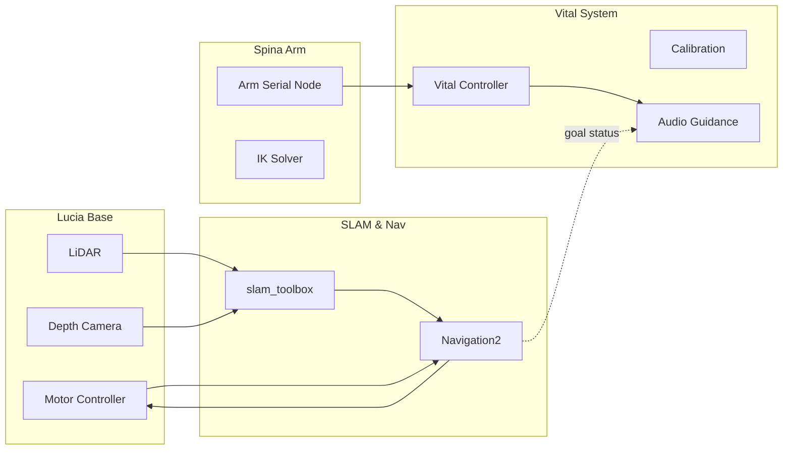

<div align="center">

# 🤖 Lucia & Spina System  
*A Modular Mobile Base + Arm + Vital Sensing Integration*  
モバイルベース（Lucia）＋ アーム（Spina）＋ バイタル計測 / 音声フィードバック（Vital）を統合した ROS 2 システム

[](https://docs.ros.org/)
[](#)
[](#license)
[](#contribution)
[](../../commits/main)
[](https://github.com/iHaruruki)

</div>

> JP: 移動・把持・生体計測を一体運用し、SLAM / Navigation / 音声ガイダンスを組み合わせる研究・開発向け統合フレーム。  
> EN: An integrated research/development framework combining mobility, manipulation, and physiological sensing with SLAM, Navigation, and audio guidance.

---

## 🧭 Quick Start (最速セットアップ / Quick Setup)

```bash
# 1. Clone (必要なリポジトリのみでも可 / you may clone only what you need)
mkdir -p ~/ros2_ws/src && cd ~/ros2_ws/src
git clone https://github.com/iHaruruki/lucia_controller.git
git clone https://github.com/iHaruruki/lucia_slam_toolbox.git
git clone https://github.com/iHaruruki/lucia_navigation2.git
git clone https://github.com/iHaruruki/urg_node2.git
git clone https://github.com/iHaruruki/maps.git

# 2. 依存解決 / Install dependencies
cd ~/ros2_ws
rosdep install --from-paths src --ignore-src -r -y

# 3. ビルド / Build
colcon build
source install/setup.bash

# 4. モータ+LiDAR 起動 / Bring up base
ros2 launch lucia_controller bringup.launch.py

# 5. キーボード操作 / Keyboard teleop
ros2 run teleop_twist_keyboard teleop_twist_keyboard
```

<details>
<summary><strong>📦 全リポジトリ Clone スクリプト / Full Repository Clone Script</strong></summary>

```bash
cd ~/ros2_ws/src
git clone https://github.com/iHaruruki/joy_to_cmdvel.git
git clone https://github.com/iHaruruki/lucia_description.git
git clone https://github.com/iHaruruki/dual_laser_merger.git
git clone https://github.com/iHaruruki/ros2_astra_camera.git
git clone https://github.com/iHaruruki/OrbbecSDK_ROS2.git
git clone https://github.com/iHaruruki/lucia_cartographer.git
git clone https://github.com/iHaruruki/spina_arm_controll.git
git clone https://github.com/iHaruruki/spina_inverse_kinematics.git
git clone https://github.com/iHaruruki/lucia_vital.git
git clone https://github.com/iHaruruki/lucia_vital_calibration.git
git clone https://github.com/iHaruruki/lucia_vital_signs_display.git
```
</details>

---

## 🧩 Component Overview (構成概要)

| Category | JP 説明 | EN Description |
|----------|---------|----------------|
| Lucia (Base) | 自律移動ベース (モータ・LiDAR・深度・SLAM・経路計画) | Mobile base: motors, LiDAR, depth, SLAM, navigation |
| Spina (Arm) | アーム制御（シリアル／逆運動学） | Arm: serial control & inverse kinematics |
| Vital | バイタル測定と音声ガイダンス | Vital measurement & audio guidance |

### System Flow Diagram / システムフローダイアグラム



---

## 📦 Package Matrix (パッケージ一覧)

| Domain | 機能 (JP) | Function (EN) | Repository |
|--------|-----------|---------------|------------|
| Base | モータ＆エンコーダ制御 | Motor & Encoder Controller | [lucia_controller](https://github.com/iHaruruki/lucia_controller) |
| Base | ジョイスティック → cmd_vel | Joystick to cmd_vel | [joy_to_cmdvel](https://github.com/iHaruruki/joy_to_cmdvel) |
| Base | URDF / 記述 | URDF / Description | [lucia_description](https://github.com/iHaruruki/lucia_description) |
| Sensing | LiDAR ドライバ (Hokuyo) | LiDAR Driver | [urg_node2](https://github.com/iHaruruki/urg_node2) |
| Sensing | デュアル LiDAR マージ | Dual LiDAR Merger | [dual_laser_merger](https://github.com/iHaruruki/dual_laser_merger) |
| Sensing | 深度カメラ (Astra Pro) | Depth Camera | [ros2_astra_camera](https://github.com/iHaruruki/ros2_astra_camera) |
| Sensing | 深度カメラ (Astra Stereo U3) | Depth Camera | [OrbbecSDK_ROS2](https://github.com/iHaruruki/OrbbecSDK_ROS2) |
| Mapping | SLAM 設定 (slam_toolbox) | SLAM Config | [lucia_slam_toolbox](https://github.com/iHaruruki/lucia_slam_toolbox) |
| Mapping | SLAM 設定 (cartographer) | SLAM Config | [lucia_cartographer](https://github.com/iHaruruki/lucia_cartographer) |
| Navigation | Navigation2 設定 | Nav2 Config | [lucia_navigation2](https://github.com/iHaruruki/lucia_navigation2) |
| Maps | マップ保管 | Map Storage | [maps](https://github.com/iHaruruki/maps) |
| Arm | アーム制御 | Arm Serial Control | [spina_arm_controll](https://github.com/iHaruruki/spina_arm_controll) |
| Arm | 逆運動学 | Inverse Kinematics | [spina_inverse_kinematics](https://github.com/iHaruruki/spina_inverse_kinematics) |
| Vital | バイタル測定 | Vital Measurement | [lucia_vital](https://github.com/iHaruruki/lucia_vital) |
| Vital | キャリブレーション | Calibration | [lucia_vital_calibration](https://github.com/iHaruruki/lucia_vital_calibration) |
| Vital | 音声/表示 | Audio / Display | [lucia_vital_signs_display](https://github.com/iHaruruki/lucia_vital_signs_display) |

---

## 🛠 Environment / 環境

| 項目 | 日本語 | English |
|------|--------|---------|
| OS | Ubuntu 20.04 / 22.04 | Ubuntu 20.04 / 22.04 |
| ROS 2 | Humble / Foxy 等 | Humble / Foxy etc. |
| 主要依存 | teleop_twist_keyboard / joy / nav2 / slam_toolbox / cartographer / YARP | same as JP |
| 権限 | `/dev/ttyUSB*` アクセス (dialout 推奨) | Serial permissions (dialout group) |
| 推奨 | LiDAR udev ルール | LiDAR udev rules |

---

## 🚶 1. Manual Teleoperation (手動操作)

JP: モータと LiDAR を起動し、キーボード/ジョイスティックで動作確認。  
EN: Bring up base + control via keyboard or joystick.

```bash
ros2 launch lucia_controller bringup.launch.py
ros2 run teleop_twist_keyboard teleop_twist_keyboard
# Joystick (optional)
ros2 run joy joy_node
ros2 run joy_to_cmdvel joy_to_cmdvel_node
```

---

## 🗺️ 2. SLAM (マップ生成 / Map Building)

JP: 走行しながら SLAM を用いて環境マップを構築。  
EN: Explore the environment to build a map.

```bash
ros2 launch lucia_controller bringup.launch.py
ros2 launch lucia_slam_toolbox online_async_launch.py
ros2 run teleop_twist_keyboard teleop_twist_keyboard
ros2 run nav2_map_server map_saver_cli -f ~/map
```

出力 (Outputs): `~/map.yaml`, `~/map.pgm`

---

## 🧭 3. Navigation (保存マップ利用 / Using Saved Map)

1. 起動 / Launch:
   ```bash
   ros2 launch lucia_controller bringup.launch.py
   ros2 launch lucia_navigation2 navigation2.launch.py \
     map:=$HOME/ros2_ws/src/lucia_navigation2/map/map.yaml \
     use_sim_time:=false
   ```
2. 初期姿勢推定 / Initial Pose (RViz2 で 2D Pose Estimate)  
3. 目標設定 / Send Navigation Goal (Navigation2 Goal ボタン)

---

## 🦾 4. Spina Arm Control (アーム制御)

```bash
sudo chmod 777 /dev/ttyUSB0  # or add to dialout group
ros2 run spina_arm_controll serial_controller_node
# 例: 全体角度 +90° / Example command
ros2 topic pub /angle_cmd std_msgs/msg/String "{ data: 'A0p-090' }" --once
```

JP: 実運用では `chmod` よりグループ権限設定推奨。  
EN: Prefer adding user to dialout instead of chmod 777 in production.

---

## 💓🔊 5. Vital Signs Display System (バイタル計測＋音声)

JP: バイタル計測と音声ガイダンス連携。  
EN: Run vital sensing and audio feedback pipeline.

```bash
# (Optional) YARP audio
yarpmanager --application /home/robot/repos/robot/script/ymanager/xml/applications/tutorial/tutorial_audio_3.xml
ros2 run spina_arm_controll serial_controller_node
ros2 run lucia_vital vital_controller_node
ros2 run lucia_vital_signs_display vital_audio_guidance_node
```

---

## 🧪 Debug / デバッグ

### Navigation 成功ステータス擬似送信 / Simulate Nav Success
```bash
ros2 topic pub \
  /navigate_to_pose/_action/status \
  action_msgs/msg/GoalStatusArray \
  "{status_list:
    [
      {
        goal_info:
          { stamp: {sec: 0, nanosec: 0},
            goal_id: {uuid: [0,0,0,0,0,0,0,0,0,0,0,0,0,0,0,1]} },
        status: 4
      }
    ]
  }" --once
```
`status: 4` = SUCCEEDED

---

## 🛠 Troubleshooting / トラブルシュート

| 症状 (JP) | Symptom (EN) | 原因 / Cause | 対処 / Fix |
|-----------|--------------|--------------|------------|
| `/dev/ttyUSB0` 権限エラー | Permission denied | 権限不足 / Not in dialout | `sudo usermod -a -G dialout $USER` |
| LiDAR スキャン無 | No LiDAR scan | ポート変更 | Check `dmesg`, `lsusb` |
| マップずれ | Map drift | オドム誤差 | Tune SLAM params |
| 音声無 | No audio | YARP / デバイス | Check yarpmanager logs |
| Nav 初期化不可 | Nav init fail | 初期姿勢未設定 | Re-set pose in RViz |

---

## 🗂 Roadmap / 今後

- English-only docs split
- Docker / devcontainer
- 統合 launch (All-in-one) / Combined mega launch
- トピック / TF 図自動生成 / Auto topic & TF diagrams
- Simulation (Gazebo / Ignition)
- Arm command protocol spec
- Architecture SVG

---